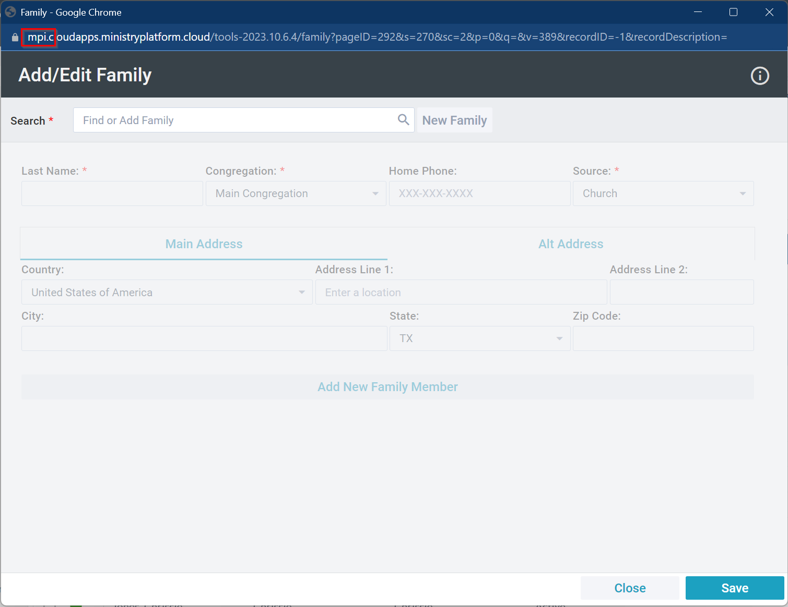

# MP Custom Widgets

MP Custom Widgets provides a Javascript library and infrastrucutre for creating custom widgets for [MinistryPlatform](https://www.acstechnologies.com/ministryplatform/).  These custom widgets can be built in any front end framework or 3rd party libraries, but are designed to interact with MinistryPlatform data and authenticaiton.

In addition to the core code, you will also find a  collection of custom widgets built against the Custom Widget Toolkit. All of these widgets contain all required elements to begin using on your website.

## Customer Examples

Here you can see what other churches have created for inspiration or to get an idea of just how flexible a Custom Widget can be:

- [Lutheran Church of Hope Classes Widget](https://wdm.lutheranchurchofhope.org/get-involved/classes/)
- [Granger Church Core Classes Dates and Times](https://grangerchurch.com/core/)
- [Perimeter Church Mission Trip Listing](https://www.perimeter.org/global-outreach/go-journeys/#upcoming-journeys)

## Contribute

If you have a widget to submit to the sample collection, please fork this collection, add your widget and all supporting resources / assets and submit a pull request. New widgets will be reviewed every 2 weeks and if deemed reusable and unique, will be added to the samples collection.

# Custom Widget Examples

- [Group Finder](./Widgets/GroupFinder/GroupFinder.md)
- [Milestone Gamification](./Widgets/MilestoneGamification/MilestoneGamification.md)
- [Publication Widgets](./Widgets/PublicationWidgets/PublicationWidgets.md)
- [View Message In Browser](./Widgets/ViewMessageInBrowser/ViewMessageInBrowser.md)
- [My Mission Trips](./Widgets/MyMissionTrips/MyMissionTrips.md)

# Custom Widget Release Information

Custom Widget core code is updated periodically. If you would like to see a history of changes, please visit the releases page:

[Custom Widget Release History](./RELEASES.md)

# Custom Widget Features

Custom Widgets has a growing list of features available to Citizen Developers seeking to build lightweight read-only widgets capable of accessing any data in [MinistryPlatform](https://www.acstechnologies.com/ministryplatform/).

## Custom Widget Tag Features

The Widget Tag is used to embed the widget into a webpage. Each custom widget will use this tag on one or multiple pages to render the widget directly into the website.

```html
<div
  id="MyCustomWidget"
  data-component="CustomWidget"
  data-sp="api_Custom_StoredProcedure"
  data-useCalendar="true"
  data-params="@ParamName=ParmValue"
  data-template="/Path/To/Template/TemplateName.html"
  data-requireUser="false"
  data-cache="true"
  data-debug="true"
  data-authOverride="true"
  data-host="mpi"
></div>
```

### id="MyCustomWidgetName"

- **_required_** attribute
- Standard DOM ID for the element
- The ID must be a unique name across all elements on the page
- The ID of the Custom Widget is used when raising events and also if you need to request that the widget be reloaded
- The ID is also now available as a data element when rendering the widget

### data-component="CustomWidget"

- **_required_** attribute
- This defines the element as a custom widget and automatically renders it as a custom widget when the DOM is loaded

### data-sp="api_Custom_StoredProcedure"

- This defines the stored procedure to use for data retrieval when this custom widget is rendered. **_Note_** - All Stored Procedures **MUST** be prefixed by api_Custom in order to be used. Additionally, any Stored Procedure **MUST** also be registered in the MinistryPlatform meta data to be accessible by Custom Widgets or the REST api at all.
- In addition to the stored procedure being properly registered with MP, it also has a couple of additional requirements:
  - Like all MP Stored Procedures, custom widget stored procedures **MUST** have a @DomainID int parameter
  - In addition the base requirements, you should **ALWAYS** inlcude the @Username nvarchar(75) parameter. You can default this to null and ignore it, but if a user logs in with standard MP widgets, you will not be able to use this widget. If your widget requires authentication, you should remove the null default.
  - You may add any other parameters necessary to make your widget work.

```sql
CREATE PROCEDURE [dbo].[api_custom_StoredProcedure]
	@DomainID int,
	@Username nvarchar(75) = null,
	@JourneyID INT = 2
AS
BEGIN

END
```

### data-useCalendar="true"
- **DEPRECATED** - This attribute is no longer used. It will be removed in a future release.
- _Defaults to: false_
- When this is set to true, the params are sent to the Event API instead of a Stored Procedure. If this is set to true it will override the data-sp parameter and events will be used instead of a Stored Procedure.

### data-params="@ParamName=ParmValue"

- Allows Parameters to be used for the innvocation of the Stored Procedure. SQL Parameter are prefixed the **@** symbol and are passed to the Custome Widget in key value pairs.
- Using Params allows a single Custom Widget to be used for various Minsitries, Campuses, etc by easily allowing parameters to be passed to set the context for the specific rendering of the widget.
- To chain multiple parameters together separate them via the **&** symbol.
- **Query String Support** - If you wrap the value component of an individual parameter key value pair in square brackets **[** **]**. The value will be retrieved from the correlating named QueryString parameter found in the current URL.
  - _Example_ - @Param=[id] - This would retrieve the value of ?id=something from the querystring of the URL and place that dynamically in the parameters sent to the stored procedure or call to the Event API.
  - By using the querystring support, you can quickly build dynamic widgets that can take dynamic data from other pages / widgets / links and create custom widgets on the fly.

### data-template="/Path/To/Template/TemplateName.html"

- This defines the path to the widget template. Custom Widgets use the [LiquidJS](https://liquidjs.com/) templating engine to render standard HTML / CSS with data retrieved from MinistryPlatform. There is ample documentation available on the Liquid website and on other help systems easily found by searching the web.
- For more information on common Liquid Usage, [Jump to Liquid Intro]()./liquid.md)
- **Note** - data-template does **NOT** support relative paths. If you just use the template name (mytemplatename.html) or even (./mytemplatename.html) you will see a 404 error when custom widgets tries to load the template. You **need** to either use the full _URL_ (https://www.whatever.com/templates/mytemplate.html) or a full relative path (/templates/mytemplate.html)
- You **_must_** specify a data-template or data-templateId for each custom widget

### data-templateId="SomeElementID"

- This defines the DOM Element ID to the widget template.
- Using this option allows for the widget liquid template to be embedded in the HTML page.
- It is highly recommend that you embed this using a **_script_** tag with a type of **text/template**. This will prevent the webpage from rendering the content, but will also keep your template markup valid in most IDEs.
- The script element **requires** and ID to be used correctly.
- You **_must_** specify a data-template or data-templateId for each custom widget

```html
<script id="pledgeTemplate" type="text/template">

  <div class="row">

    
    <div class="col-6">
      <div class="card">
          <div class="card-body">
            <h5 class="card-title">Capital Campaign Progress</h5>
            <p class="card-text">
              <div class="progress">
                  <div class="progress-bar progress-bar-warning" role="progressbar" style="width: {{element.Percentage}}%" aria-valuenow="{{element.Percentage}}" aria-valuemin="0" aria-valuemax="100"></div>
              </div>
              <div>
                  <span style="float:right;">100%</span>
                  <span style="float:left;">0%</span>
              </div>

              <div class="text-center">
                  ${{element.Progress | number_to_currency}} of ${{element.Total | number_to_currency}} Goal
              </div>

            </p>
            <a href="#" class="btn btn-primary">Pledge Now</a>
          </div>
        </div>
  </div>
  

  </div>
</script>
```

### data-requireUser="false"

- _Defaults to: false_
- When set to true, the widget will require a user to be logged in. Login is accomplished by using the standard MP Login Widget. Note: Anytime a user is loggded in to widgets on the website hosting the custom widget, the user will be sent with the request.
- If you set the requireUser="true", you should also include the @UserName parameter to be non-nullable in your stored procedure to enforce the username requirement across all parts of the custom widget system.
- **Note** - You must include a @Username nvarchar(75) nonnullable parameter in your Stored Procedure. To compare against User_ID, don't forget to query for User_ID.

### data-cache="true"

- _Defaults to: true_
- This parameter controls whether or not the data element is cached. This defaults to _true_ to improve performance. The cached data is held in memory and does not hit the MinistryPlatform instance on each request.
- Cache is computed from the Stored Procedure Name and **ALL** params that are sent with the request.
- Cache Timeout is 5 minutes and is absolute. This means data is cached upon the first request and is cached for the duration of 5 minutes.

### data-debug="true"

- _Defaults to: false_
- When set to _true_, the javascript engine with output extra debugging information in the javascript console. In addition to various debugging messages about Widget Initialization and Rendering, **all** data retrieved from the Stored Procedure or Events API will be output to the console.
- **_Best Practice_** - Set this to false or just remove the data-debug element entirely when publishing to production.

### data-authOverride="true"

- _Defaults to: false_
- When set to _true_, customWidgets.js will **NOT** output the red bootstrap 5 alert informing the user they are not logged in.  This would then require you to create your own unathenticated notification to web users.  You can make use of the userAuthenticated boolean value provided inside the widget data model.

### data-host="mpi"

- **_required_** attribute
- This is the MinistryPlatform Cloud Host. This value is unique per customer and is easily located by Launching the Add / Edit Family Tool and noting the first element of the hostname.
- 

## Custom Widget Javascript

You can find the [customWidget.js](./dist/) files in the "DIST" folder if you want to download them or you can reference the latest version from the MinistryPlatform CDN:

[https://mpweb.azureedge.net/cdn/customWidget.js](https://mpweb.azureedge.net/cdn/customWidget.js)

Example of including the javascript file in your webpage:

```javascript
<script
  type="text/javascript"
  src="https://mpweb.azureedge.net/cdn/customWidget.js"
></script>
```

## Custom Liquid Filters / Extensions

Starting in 2024.04.19, custom widgets will have some custom filters that are available for the community. Each filter with usage examples will be documented here.

### mp_currency | US Currency Format

This filter quickly converts numbers to US based currency. Decimal places beyond 2 will be rounded accordinly. Numbers will be prepended with the $ dollar sign and digits will be comma separated.

Usage (in your template):

```
<div>
  {{ NumberVariableOrObject | mp_currency }}
</div>
```

## Force Login (Optional)

There is an additional / optional Javascript file called forceLogin.js in the dist folder.  This optional javascript can be used to not only require authentication to certain widgets, but to automatically redirect to the MinistryPlatform Single Sign On (SSO) interface when the page encounters a widget requiring authentication.  This javascript file requires a very minor configuration.  At the top of the javascript is the following configuration variable:

```javascript
// Force Login Script
// Update the mpHost to match your MinistryPlatform configuration
// Simply include this script on any page with a user secured widget and it will automatically redirect to the SSO page and force the user to login

// -------------------------------------------------------
// CHANGE this to your MP HOST!!!
const mpHost = 'mpi.ministryplatform.com';
// -------------------------------------------------------
...
```

You must change this to be your MP host.  After that simple include this javascript on any page you want to force login.

## JavaScript Events

A JavaScript Event of "widgetLoaded" will be fired when your widget has been loaded.

```javascript
window.addEventListener('widgetLoaded', function(event) {
  console.log('|||===> widgetLoaded Event Fired for: ' + event.detail.widgetId);
});
```