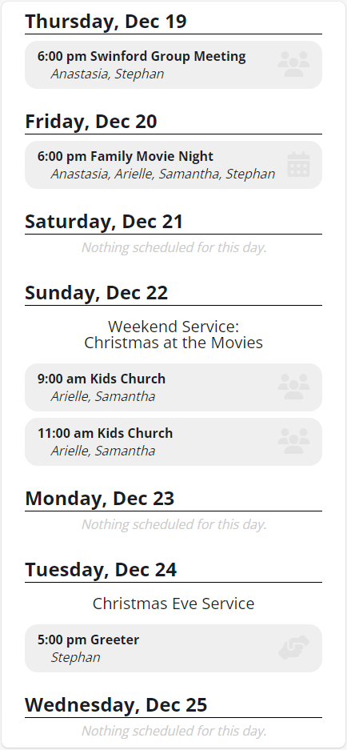

# My Week Custom Widget

This is an exmple of a custom Widget that will return the next week's events for a user's household.

## Features

- Can be configured to require authentication or accept a parameter for UserGUID. Useful for linking to from PocketPlatform!
- Shows upcoming events for the user and members of their household.
- Optional CSS styling for "Dark Mode" browsers included.

## Screenshot

