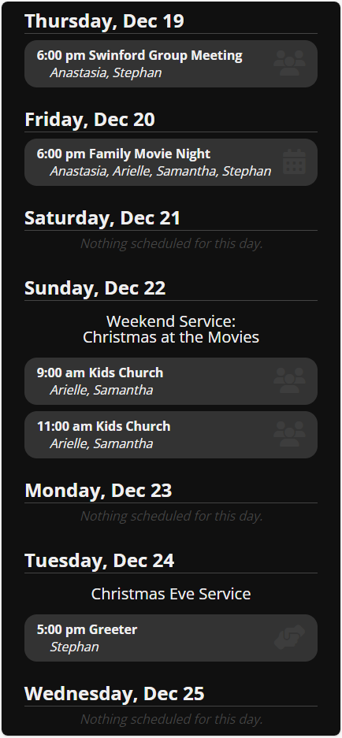

# My Week Custom Widget

This is an exmple of a custom Widget that will return the next week's events for all contacts in a user's household.

## Features

- Can be configured to require authentication or accept a parameter for User_GUID. Useful for linking to this widget from PocketPlatform!
- Shows upcoming events for the user and members of their household.
- Optional CSS styling for "Dark Mode" included.
- Pass the @DaysAhead parameter to change from the default of 7 days to however many days you want to display.
- Pass the @EventTypeID for your worship services, which will condense multiple services to one heading.
- Pass @FeaturedEvents=1 to also highlight your featured events at the top of a day.

## Screenshots
Light Mode:

Dark Mode:

