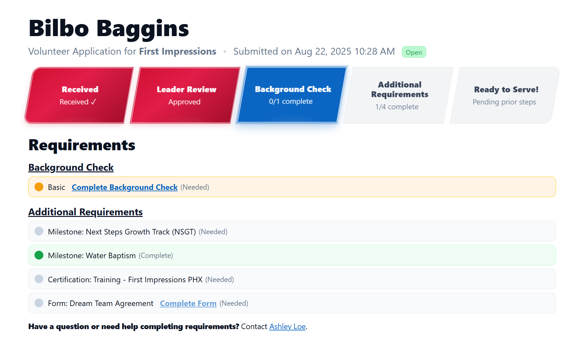

# Volunteer Tracker Widget

The Volunteer Tracker is a Domino’s Pizza Tracker–inspired widget that helps volunteers see exactly where they are in the application process. Just like watching your pizza go from “Order Placed” to “Out for Delivery,” this tracker moves you from “Application Received” to “Ready to Serve!”—minus the melted cheese (unless you’re volunteering in the kitchen 🍕).

## Features

- **Domino’s-Style Progress Bar**: Big, bold, and colorful stages that light up as you complete each requirement.
- **Stages Include**:
  1. **Received** – Your application is in!
  2. **Leader Review** – Waiting for approval from your leader.
  3. **Background Check** – If required, shows progress and provides a link to complete it.
  4. **Additional Requirements** – Tracks milestones, certifications, and forms.
  5. **Ready to Serve!** – All steps complete and you’re good to go.
- **Uses Group Type Requirements**: Checks for any Requirements based on the Group Role associated with the Opportunity.
- **Helpful Links**: Direct links to complete background checks or forms if they’re still pending.
- **Contact Info**: Displays the opportunity leader’s name and email for quick help.
- **No Auth Required**: Just add ?response=[Response_ID]&cid=[Contact_GUID] to the URL this widget is on to load the tracker.

## Screenshots

